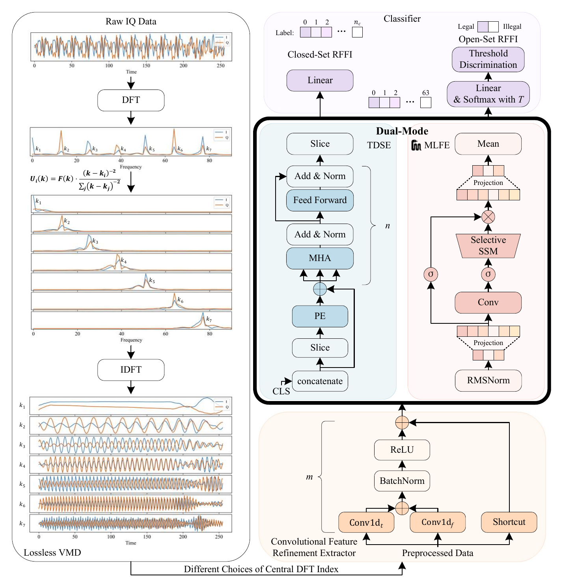

# HyDRA: A Hybrid Dual-Mode Network for Closed- and Open-Set RFFI with Optimized VMD

Paper: https://doi.org/10.1109/JIOT.2025.3621243

<p align="center">
  
</p>

HyDRA combines lossless VMD preprocessing with a dual-mode neural network for
radio frequency fingerprint identification. IQ samples are decomposed with fixed
central DFT indices, refined by a Convolutional Feature Refinement Extractor
(CFRE), and encoded by either the Transformer Dynamic Sequence Encoder (TDSE)
for high-accuracy sequence modeling or the Mamba Linear Flow Encoder (MLFE) for
linear-complexity processing. Closed-set classification uses the final linear
classifier, while open-set classification applies temperature-scaled softmax and
maximum-probability threshold discrimination.

## Repository Layout

```text
HyDRA/
|-- figs/
|   `-- framework.png
|-- hydra_rffi/
|   |-- model.py          # CFRE, TDSE, MLFE, and HyDRA classifier
|   |-- open_set.py       # temperature softmax and threshold discrimination
|   `-- preprocessing.py  # lossless VMD and IQ decomposition utilities
|-- configs/
|   `-- paper_defaults.yaml
|-- examples/
|   `-- smoke_forward.py  # synthetic TDSE/MLFE forward-pass check
|-- requirements.txt
`-- README.md
```

## Method Mapping

| Paper module | Code |
| --- | --- |
| Lossless VMD | `central_dft_indices`, `lossless_vmd_1d`, `decompose_iq` |
| Convolutional Feature Refinement Extractor | `ConvolutionalFeatureRefinementExtractor` |
| Transformer Dynamic Sequence Encoder | `TransformerDynamicSequenceEncoder` |
| Mamba Linear Flow Encoder | `MambaLinearFlowEncoder`, `MinimalMambaBlock` |
| Closed-Set RFFI | `HyDRA.classifier` |
| Open-Set RFFI | `temperature_softmax`, `max_softmax_decision` |

## Quick Start

Install the core dependencies:

```bash
pip install -r requirements.txt
```

Run a synthetic forward pass:

```bash
python examples/smoke_forward.py
```

The default paper setting uses lossless VMD with `k = 3`. For IQ input this
produces `2 * k = 6` channels, so the model input has shape:

```python
(batch, 256, 6)
```

Instantiate either dual-mode encoder:

```python
from hydra_rffi import HyDRA

tdse_model = HyDRA(mode="tdse", input_channels=6, num_classes=28)
mlfe_model = HyDRA(mode="mlfe", input_channels=6, num_classes=28)
```

Apply open-set threshold discrimination to logits:

```python
from hydra_rffi import max_softmax_decision

decision = max_softmax_decision(logits, threshold=0.999, temperature=1.6)
```

## Acknowledgements

The experiments in the paper use the WiSig SingleDay and ManyTx datasets. The
MLFE module includes a minimal Mamba-style selective SSM block, matching the
deployment-side substitution described in the paper when the official
`mamba_ssm` package is unavailable.

## Citation

Liu H, Huang Y, Gong Y, Zhai Y and Lu J. HyDRA: A Hybrid Dual-Mode Network for
Closed- and Open-Set RFFI with Optimized VMD. IEEE Internet of Things Journal.
doi: 10.1109/JIOT.2025.3621243

```bibtex
@article{liu2025hydra,
  title = {HyDRA: A Hybrid Dual-Mode Network for Closed- and Open-Set RFFI with Optimized VMD},
  author = {Liu, Hanwen and Huang, Yuhe and Gong, Yifeng and Zhai, Yanjie and Lu, Jiaxuan},
  journal = {IEEE Internet of Things Journal},
  year = {2025},
  doi = {10.1109/JIOT.2025.3621243}
}
```
